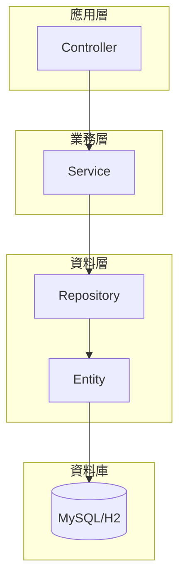
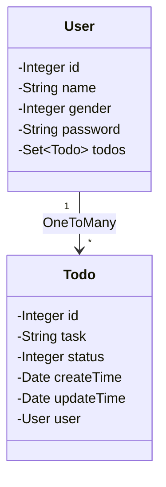
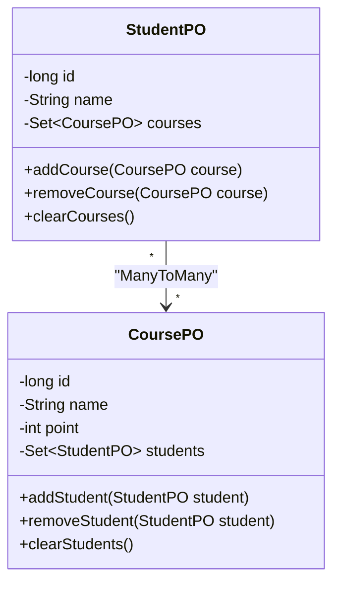
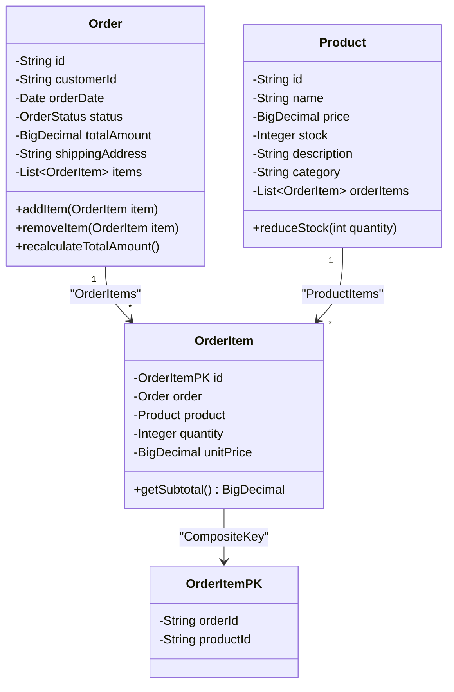

## 🎯 學習檢查清單

### 基礎概念
- [ ] JPA 實體的基本註解 (@Entity, @Table, @Id, @Column)
- [ ] 主鍵生成策略 (@GeneratedValue)
- [ ] Lombok 註解的使用 (@Data, @Getter, @Setter)

### 關係對應
- [ ] 一對多關係 (@OneToMany, @ManyToOne)
- [ ] 多對多關係 (@ManyToMany, @JoinTable)
- [ ] 複合主鍵 (@EmbeddedId, @Embeddable)
- [ ] 級聯操作 (CascadeType)
- [ ] 延遲載入 (FetchType.LAZY)

### 進階功能
- [ ] 檔案上傳到資料庫 (@Lob)
- [ ] 自動時間戳記 (@CreatedDate, @LastModifiedDate)
- [ ] 列舉類型 (@Enumerated)
- [ ] JSON 序列化控制 (@JsonManagedReference, @JsonBackReference)

### 實務應用
- [ ] 雙向關係維護方法
- [ ] 避免循環引用的策略
- [ ] PostgreSQL 特有功能的使用
- [ ] Thymeleaf 模板整合

## 📋 專案簡介

本專案是一個 Spring Boot 應用程式，主要用於練習 Spring JPA 中各種實體關係的建立與操作，同時包含檔案上傳到資料庫的功能實作。

### 🎯 專案目標
- 實作 JPA 各種關係：一對一、一對多、多對多
- 練習檔案上傳與儲存到資料庫
- 學習複合主鍵的使用
- 熟悉實體關係的維護與級聯操作

## 🏗️ 系統架構



## 📊 實體關係圖

### 完整 ER 圖


## 🔗 實體關係詳解

### 1. User ↔ Todo（一對多關係）



**關係說明：**
- 一個用戶可以擁有多個待辦事項
- 使用 `@OneToMany` 和 `@ManyToOne` 註解
- 使用 JSON 註解避免序列化時的循環引用

### 2. Student ↔ Course（多對多關係）



**關係說明：**
- 一個學生可以選修多門課程，一門課程可以被多個學生選修
- 使用中介表 `selected_course` 維護關係
- 提供雙向關係維護方法確保資料一致性

### 3. Order ↔ Product（多對多 with 額外屬性）



**關係說明：**
- 訂單和產品之間是多對多關係，但需要額外資訊（數量、單價）
- 使用 `OrderItem` 作為中介實體，包含複合主鍵
- 實現訂單總金額的自動計算功能

### 4. Image（檔案上傳實體）

```mermaid
classDiagram
    class Image {
        -Long id
        -String name
        -String contentType
        -byte[] data
        -Date uploadDate
        +Image()
        +Image(String name, String contentType, byte[] data)
    }
    
    note for Image : "File Upload Entity with @Lob"
```

**功能說明：**
- 用於練習檔案上傳功能
- 將檔案直接儲存在資料庫中（使用 `@Lob` 註解）
- 自動記錄上傳時間

## 🛠️ 技術棧

- **框架**: Spring Boot 3.4.5
- **ORM**: Spring Data JPA / Hibernate
- **資料庫**: PostgreSQL
- **建構工具**: Gradle 8.x
- **Java 版本**: OpenJDK 17
- **模板引擎**: Thymeleaf
- **開發工具**: Spring Boot DevTools, Lombok
- **檔案處理**: Spring MultipartFile

## 📁 專案結構

```
src/main/java/com/example/demo/
├── entity/
│   ├── User.java                 # 用戶實體
│   ├── Todo.java                 # 待辦事項實體
│   ├── StudentPO.java            # 學生實體
│   ├── CoursePO.java             # 課程實體
│   ├── Order.java                # 訂單實體
│   ├── Product.java              # 產品實體
│   ├── OrderItem.java            # 訂單明細實體
│   ├── Image.java                # 圖片檔案實體
│   └── compoundKey/
│       └── OrderItemPK.java      # 複合主鍵
├── repository/
├── service/
└── controller/
```

## 🚀 快速開始

### 1. 環境要求
- Java 17 (OpenJDK)
- Gradle 8.x
- PostgreSQL 12+

### 2. 資料庫設定
```properties
# application.properties
spring.datasource.url=jdbc:postgresql://localhost:5432/jpa_practice
spring.datasource.username=your_username
spring.datasource.password=your_password
spring.datasource.driver-class-name=org.postgresql.Driver

spring.jpa.hibernate.ddl-auto=update
spring.jpa.show-sql=true
spring.jpa.database-platform=org.hibernate.dialect.PostgreSQLDialect

# Thymeleaf 設定
spring.thymeleaf.cache=false
```

### 3. PostgreSQL 資料庫建立
```sql
-- 建立資料庫
CREATE DATABASE jpa_practice;

-- 建立用戶 (可選)
CREATE USER jpa_user WITH PASSWORD 'your_password';
GRANT ALL PRIVILEGES ON DATABASE jpa_practice TO jpa_user;
```

### 4. 執行專案
```bash
# 使用 Gradle Wrapper
./gradlew bootRun

# 或者
gradle bootRun
```

## 📚 學習重點

### JPA 關係類型實作
1. **@OneToMany / @ManyToOne**: User ↔ Todo
2. **@ManyToMany**: Student ↔ Course
3. **複合主鍵**: OrderItem 使用 @EmbeddedId
4. **級聯操作**: CascadeType 的使用
5. **延遲載入**: FetchType.LAZY 設定

### 檔案上傳功能
- 使用 `@Lob` 註解儲存二進位資料
- 檔案類型和大小的處理
- 上傳時間的自動記錄

### 最佳實踐
- 雙向關係的維護方法
- 避免 toString() 和 equals() 的循環引用
- JSON 序列化的循環引用處理
- 複合主鍵的實作方式

## 🧪 測試資料

可以使用以下 SQL 腳本建立測試資料：

```sql
-- 用戶和待辦事項
INSERT INTO tbl_user (name, gender, password) VALUES ('Alice', 1, 'password123');
INSERT INTO todo (task, user_id) VALUES ('完成專案文件', 1);

-- 學生和課程
INSERT INTO student (name) VALUES ('張三'), ('李四');
INSERT INTO course (name, point) VALUES ('Java程式設計', 3), ('資料庫系統', 4);

-- 產品和訂單
INSERT INTO product (product_id, product_name, price, stock, description, category) VALUES 
('PROD001', '筆記型電腦', 25000.00, 10, '高效能筆記型電腦', '電腦設備');

-- 新增選課關係
INSERT INTO selected_course (student, course) VALUES (1, 1), (1, 2), (2, 1);
```

## 📁 Gradle 專案結構

```
project-root/
├── build.gradle                 # 專案建構檔案
├── gradle.properties            # Gradle 設定
├── src/
│   ├── main/
│   │   ├── java/com/example/demo/
│   │   │   ├── entity/          # 實體類別
│   │   │   ├── repository/      # 資料存取層
│   │   │   ├── service/         # 業務邏輯層
│   │   │   ├── controller/      # 控制器層
│   │   │   └── DemoApplication.java
│   │   └── resources/
│   │       ├── application.properties
│   │       ├── static/          # 靜態資源
│   │       └── templates/       # Thymeleaf 模板
│   └── test/
└── gradle/wrapper/              # Gradle Wrapper
```

## 🔧 開發工具設定

### IDE 設定
- **推薦**: IntelliJ IDEA 或 VS Code
- **Lombok**: 需要安裝 Lombok 插件並啟用 annotation processing
- **資料庫工具**: pgAdmin 或 DBeaver (PostgreSQL 管理)

### 開發模式
```properties
# application-dev.properties (開發環境)
spring.profiles.active=dev
spring.jpa.hibernate.ddl-auto=create-drop
spring.jpa.show-sql=true
spring.jpa.properties.hibernate.format_sql=true

# DevTools 設定
spring.devtools.restart.enabled=true
spring.devtools.livereload.enabled=true
```

### 生產環境設定
```properties
# application-prod.properties (生產環境)
spring.profiles.active=prod
spring.jpa.hibernate.ddl-auto=validate
spring.jpa.show-sql=false

# 連線池設定
spring.datasource.hikari.maximum-pool-size=10
spring.datasource.hikari.minimum-idle=5
```