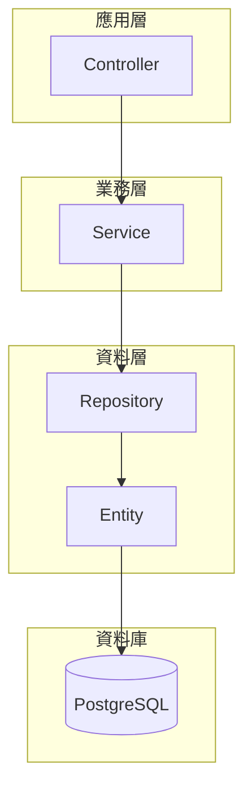
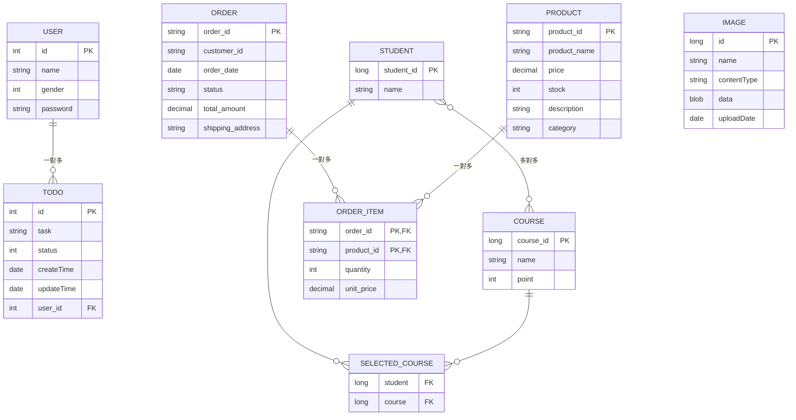

# Spring JPA 關係練習專案

## 📋 專案簡介

本專案是一個 Spring Boot 應用程式，主要用於練習 Spring JPA 中各種實體關係的建立與操作，同時包含檔案上傳到資料庫的功能實作。

### 🎯 專案目標
- 實作 JPA 各種關係：一對一、一對多、多對多
- 練習檔案上傳與儲存到資料庫
- 學習複合主鍵的使用
- 熟悉實體關係的維護與級聯操作

## 🏗️ 系統架構



## 📊 實體關係圖

### 完整 ER 圖



## 🔗 實體關係詳解

### 1. User ↔ Todo（一對多關係）

```mermaid
classDiagram
    class User {
        -Integer id
        -String name
        -Integer gender
        -String password
        -Set~Todo~ todos
    }
    
    class Todo {
        -Integer id
        -String task
        -Integer status
        -Date createTime
        -Date updateTime
        -User user
    }
    
    User ||--o{ Todo : "一個用戶可以有多個待辦事項"
    
    note for User : "@OneToMany(mappedBy='user')"
    note for Todo : "@ManyToOne @JoinColumn(name='user_id')"
```

**關係說明：**
- 一個用戶可以擁有多個待辦事項
- 使用 `@OneToMany` 和 `@ManyToOne` 註解
- 使用 JSON 註解避免序列化時的循環引用

### 2. Student ↔ Course（多對多關係）

```mermaid
classDiagram
    class StudentPO {
        -long id
        -String name
        -Set~CoursePO~ courses
        +addCourse(CoursePO course)
        +removeCourse(CoursePO course)
        +clearCourses()
    }
    
    class CoursePO {
        -long id
        -String name
        -int point
        -Set~StudentPO~ students
        +addStudent(StudentPO student)
        +removeStudent(StudentPO student)
        +clearStudents()
    }
    
    StudentPO }o--o{ CoursePO : "學生選課關係"
    
    note for StudentPO : "@ManyToMany(mappedBy='students')"
    note for CoursePO : "@JoinTable(name='selected_course')"
```

**關係說明：**
- 一個學生可以選修多門課程，一門課程可以被多個學生選修
- 使用中介表 `selected_course` 維護關係
- 提供雙向關係維護方法確保資料一致性

### 3. Order ↔ Product（多對多 with 額外屬性）

```mermaid
classDiagram
    class Order {
        -String id
        -String customerId
        -Date orderDate
        -OrderStatus status
        -BigDecimal totalAmount
        -String shippingAddress
        -List~OrderItem~ items
        +addItem(OrderItem item)
        +removeItem(OrderItem item)
        +recalculateTotalAmount()
    }
    
    class Product {
        -String id
        -String name
        -BigDecimal price
        -Integer stock
        -String description
        -String category
        -List~OrderItem~ orderItems
        +reduceStock(int quantity)
    }
    
    class OrderItem {
        -OrderItemPK id
        -Order order
        -Product product
        -Integer quantity
        -BigDecimal unitPrice
        +getSubtotal() BigDecimal
    }
    
    class OrderItemPK {
        -String orderId
        -String productId
    }
    
    Order ||--o{ OrderItem : "訂單明細"
    Product ||--o{ OrderItem : "產品明細"
    OrderItem --> OrderItemPK : "複合主鍵"
    
    note for OrderItem : "使用複合主鍵處理多對多關係"
```

**關係說明：**
- 訂單和產品之間是多對多關係，但需要額外資訊（數量、單價）
- 使用 `OrderItem` 作為中介實體，包含複合主鍵
- 實現訂單總金額的自動計算功能

### 4. Image（檔案上傳實體）

```mermaid
classDiagram
    class Image {
        -Long id
        -String name
        -String contentType
        -byte[] data
        -Date uploadDate
        +Image()
        +Image(String name, String contentType, byte[] data)
    }
    
    note for Image : "用於練習檔案上傳到資料庫"
```

**功能說明：**
- 用於練習檔案上傳功能
- 將檔案直接儲存在資料庫中（使用 `@Lob` 註解）
- 自動記錄上傳時間

## 🛠️ 技術棧

- **框架**: Spring Boot 3.x
- **ORM**: Spring Data JPA / Hibernate
- **資料庫**: PostgreSQL
- **工具**: Lombok
- **檔案處理**: Spring MultipartFile

## 📁 專案結構

```
src/main/java/com/example/demo/
├── entity/
│   ├── User.java                 # 用戶實體
│   ├── Todo.java                 # 待辦事項實體
│   ├── StudentPO.java            # 學生實體
│   ├── CoursePO.java             # 課程實體
│   ├── Order.java                # 訂單實體
│   ├── Product.java              # 產品實體
│   ├── OrderItem.java            # 訂單明細實體
│   ├── Image.java                # 圖片檔案實體
│   └── compoundKey/
│       └── OrderItemPK.java      # 複合主鍵
├── repository/
├── service/
└── controller/
```

## 🚀 快速開始

### 1. 環境要求
- Java 17+
- Maven 3.6+
- PostgreSQL ()

### 2. 資料庫設定
```properties
# application.properties
spring.datasource.url=jdbc:postgresql://localhost:5432/test
spring.datasource.username=your_username
spring.datasource.password=your_password

spring.jpa.hibernate.ddl-auto=update
spring.jpa.show-sql=true
```

### 3. 執行專案
```bash
mvn spring-boot:run
```

## 📚 學習重點

### JPA 關係類型實作
1. **@OneToMany / @ManyToOne**: User ↔ Todo
2. **@ManyToMany**: Student ↔ Course
3. **複合主鍵**: OrderItem 使用 @EmbeddedId
4. **級聯操作**: CascadeType 的使用
5. **延遲載入**: FetchType.LAZY 設定

### 檔案上傳功能
- 使用 `@Lob` 註解儲存二進位資料
- 檔案類型和大小的處理
- 上傳時間的自動記錄

### 最佳實踐
- 雙向關係的維護方法
- 避免 toString() 和 equals() 的循環引用
- JSON 序列化的循環引用處理
- 複合主鍵的實作方式

## 🤝 貢獻

歡迎提交 Issue 和 Pull Request 來改善這個學習專案！