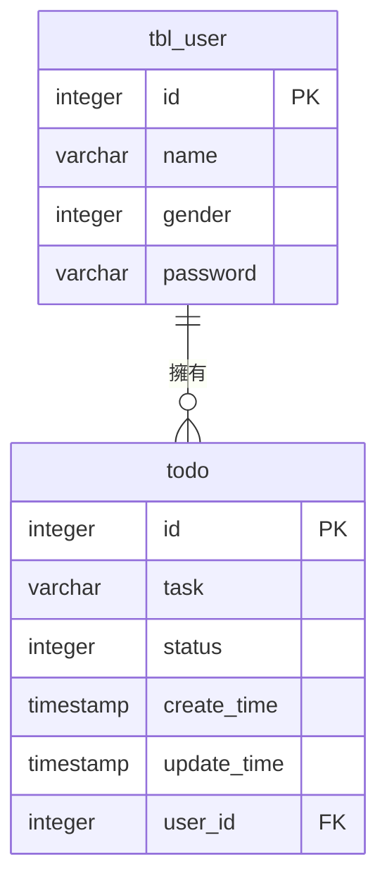
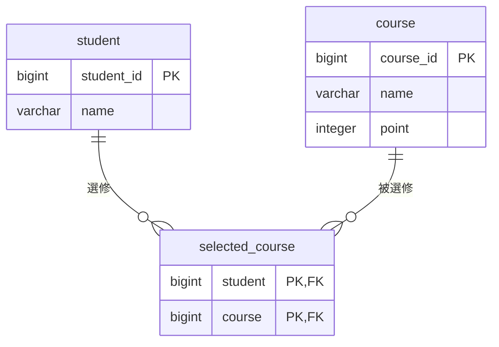
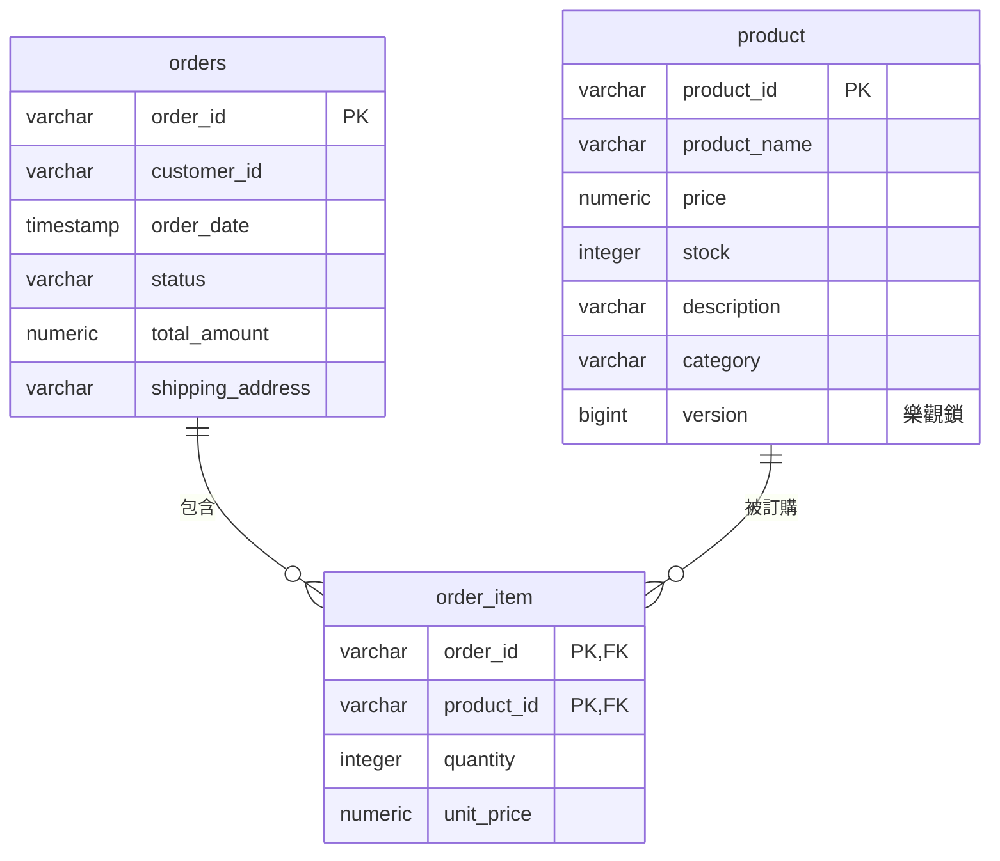
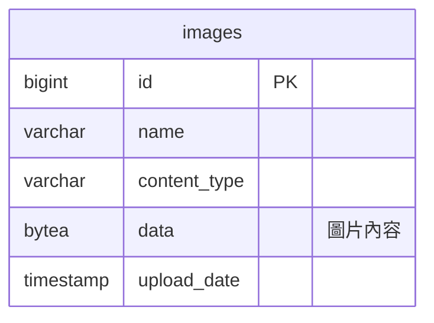

# Spring Data JPA 進階 - 實體關係、訂單與圖片上傳

練習 Spring Data JPA 各種實體關係（一對多、多對多、帶額外欄位的多對多與複合主鍵），並實作訂單 / 庫存的商業邏輯與圖片上傳。

這是本 Repo 2025 年的 JPA 進階練習，已完成現代化（Spring Boot 3.4 → 4.1），過程中修正了訂單與庫存的多個商業邏輯 Bug，詳見下方「[現代化紀錄](#現代化紀錄)」。

## 技術版本

| 項目 | 版本 |
|---|---|
| Java | 21 |
| Spring Boot | 4.1.1 |
| Hibernate | 7.4 |
| Gradle | 9.8.0（使用 Gradle Wrapper） |
| Database | PostgreSQL |
| 頁面 | Thymeleaf（圖片上傳頁） |
| 測試 | JUnit 5、Testcontainers 2.0（`@ServiceConnection`）、TestRestTemplate |

## 架構

```text
Client
  ↓  JSON（REST API）/ HTML（圖片上傳頁）
Controller            Request / Response 使用 DTO、@Valid 驗證輸入
  ↓
Service               商業邏輯、交易邊界（@Transactional）、訂單狀態機
  ↓
Repository            Spring Data JPA（衍生查詢、JPQL、@EntityGraph、原生 SQL 投影）
  ↓
PostgreSQL            資料表由 Hibernate 自動建立（ddl-auto=update）

GlobalExceptionHandler（@RestControllerAdvice）統一將錯誤轉為 RFC 9457 ProblemDetail
```

## 資料模型

本模組的資料表分成彼此獨立的四組。每組先以 ER 圖呈現資料表結構（實際的資料表 / 欄位名稱與 PostgreSQL 型別），再說明對應的 JPA Entity 寫法。

> 圖例：`||` 恰好一筆、`o{` 零或多筆。PK = 主鍵、FK = 外鍵。

### 1. 使用者與待辦事項（一對多）


```mermaid
erDiagram
    tbl_user ||--o{ todo : "擁有"
    tbl_user {
        integer id PK
        varchar name
        integer gender
        varchar password
    }
    todo {
        integer id PK
        varchar task
        integer status
        timestamp create_time
        timestamp update_time
        integer user_id FK
    }
```

| 資料表 | Entity |
|---|---|
| `tbl_user` | `User` |
| `todo` | `Todo` |

- `Todo.user` 是 `@ManyToOne`，外鍵 `user_id` 由它維護；`User.todos` 是 `@OneToMany(mappedBy = "user")`
- `@JsonManagedReference` / `@JsonBackReference` 避免 JSON 序列化時無限循環
- `create_time` / `update_time` 由 Spring Data JPA Auditing（`@CreatedDate` / `@LastModifiedDate`）自動設定

### 2. 學生與課程（多對多）


```mermaid
erDiagram
    student ||--o{ selected_course : "選修"
    course ||--o{ selected_course : "被選修"
    student {
        bigint student_id PK
        varchar name
    }
    course {
        bigint course_id PK
        varchar name
        integer point
    }
    selected_course {
        bigint student PK, FK
        bigint course PK, FK
    }
```

| 資料表 | Entity |
|---|---|
| `student` | `StudentPO` |
| `course` | `CoursePO` |
| `selected_course` | 沒有 Entity，由 `@ManyToMany` + `@JoinTable` 自動維護 |

- 一個學生可以選修多門課程，一門課程可以有多個學生
- `CoursePO.students` 是擁有方（`@JoinTable`），`StudentPO.courses` 是 `mappedBy` 的另一方
- 雙向關係維護方法（`addStudent` / `removeStudent` / `clearStudents`、`addCourse` / `removeCourse` / `clearCourses`）同時更新兩邊的集合，確保一致

### 3. 訂單與商品（帶額外欄位的多對多 + 複合主鍵）


```mermaid
erDiagram
    orders ||--o{ order_item : "包含"
    product ||--o{ order_item : "被訂購"
    orders {
        varchar order_id PK
        varchar customer_id
        timestamp order_date
        varchar status
        numeric total_amount
        varchar shipping_address
    }
    order_item {
        varchar order_id PK, FK
        varchar product_id PK, FK
        integer quantity
        numeric unit_price
    }
    product {
        varchar product_id PK
        varchar product_name
        numeric price
        integer stock
        varchar description
        varchar category
        bigint version "樂觀鎖"
    }
```

| 資料表 | Entity |
|---|---|
| `orders` | `Order`（`order` 是 SQL 保留字） |
| `order_item` | `OrderItem`，主鍵為 `OrderItemPK` |
| `product` | `Product` |

- 訂單與商品是多對多，但需要額外資訊（數量、單價），因此以 `OrderItem` 作為中介實體，而不是 `@ManyToMany`
- `OrderItem` 使用複合主鍵 `@EmbeddedId`（`OrderItemPK`），並以 `@MapsId` 對應到 Order 與 Product
- `Order.addItem` / `removeItem` 同時維護兩邊的關聯，並由 `recalculateTotalAmount()` 重新計算總金額
- `Product.reduceStock` 集中檢查庫存；`Product.version` 為 `@Version` 樂觀鎖，避免同時下單時庫存更新互相覆蓋

#### 訂單狀態機

```text
PENDING ──▶ PROCESSING ──▶ SHIPPED ──▶ DELIVERED
   │             │
   └──────┬──────┘
          ▼
      CANCELLED
```

- 只能依箭頭方向前進一步，不能跳過或倒退（`OrderStatus.canTransitionTo`）
- 只有 PENDING、PROCESSING 可以取消；取消必須透過 `POST /api/orders/{id}/cancel`，才會補回庫存
- DELIVERED、CANCELLED 為最終狀態

### 4. 圖片（獨立資料表）


```mermaid
erDiagram
    images {
        bigint id PK
        varchar name
        varchar content_type
        bytea data "圖片內容"
        timestamp upload_date
    }
```

| 資料表 | Entity |
|---|---|
| `images` | `Image` |

- 圖片內容直接存在資料庫的 `bytea` 欄位
- 不使用 `@Lob`：Hibernate 在 PostgreSQL 會把 `@Lob byte[]` 存成 `oid`（Large Object），讀取必須在交易中，刪除資料列時也不會自動刪除 Large Object
- 圖片清單只回傳摘要（名稱、類型、大小），大小由資料庫以 `octet_length` 計算，不把圖片內容讀進記憶體

## 專案結構

```text
src/main/java/com/example/demo/
├── config/JpaAuditingConfig.java     # 啟用 JPA Auditing
├── controller/                       # REST API 與圖片上傳頁
├── dto/                              # Response / Request DTO
├── request/                          # 訂單、使用者、待辦事項的 Request
├── entity/                           # JPA Entity（compoundKey/OrderItemPK 為複合主鍵）
├── exception/                        # 自訂例外與 GlobalExceptionHandler
├── repository/                       # Spring Data JPA Repository
└── service/                          # 商業邏輯
docs/sql/images-oid-to-bytea.sql      # 既有資料庫的圖片欄位轉換 SQL
```

## 執行方式

需要 JDK 21 與 PostgreSQL（資料庫名稱 `test`）。

```bash
./gradlew bootRun        # Windows：gradlew.bat bootRun
```

- 預設 port：`8015`
- 圖片上傳頁：http://localhost:8015/
- 資料庫帳密由環境變數 `DB_USERNAME` / `DB_PASSWORD` 提供（預設 `postgres` / `postgres`），連線設定的詳細說明可參考 [Spring_JPA 的「資料庫連線設定」](../Spring_JPA/readme.md#資料庫連線設定)

### 既有資料庫升級（圖片欄位 oid → bytea）

若資料庫是用舊版本建立的（`images.data` 為 `oid`），請在啟動新版**之前**執行：

```bash
# 建議先備份。使用 -t 指定資料表時，Large Object 預設「不會」被備份，必須加上 -b
pg_dump -U postgres -d test -t images -b -Fc -f images-backup.dump
pg_restore -l images-backup.dump    # 確認清單中有 BLOB 項目

psql -U postgres -d test -f docs/sql/images-oid-to-bytea.sql
```

`ddl-auto=update` 不會修改既有欄位的型別，因此需要手動轉換。`product.version` 欄位則會自動新增，既有資料的版本會補上 0。

## API

所有錯誤皆回傳 [RFC 9457 ProblemDetail](https://www.rfc-editor.org/rfc/rfc9457)（`application/problem+json`）：

| 狀態碼 | 意義 | 例子 |
|---|---|---|
| `400` | 請求內容有問題 | 欄位驗證失敗（附 `errors` 欄位）、Request Body 參照的商品不存在 |
| `404` | URL 指定的資源不存在 | `GET /api/orders/{id}` 查不到訂單 |
| `409` | 與目前資料狀態衝突 | 庫存不足、不允許的狀態轉換、同時修改同一筆資料（樂觀鎖） |

```json
{
  "status": 400,
  "title": "Bad Request",
  "detail": "請求內容驗證失敗",
  "errors": { "name": "商品名稱不可為空", "price": "價格不可為空" }
}
```

### 商品 `/api/products`

| Method | Path | 說明 |
|---|---|---|
| `GET` | `/api/products` | 查詢全部 |
| `GET` | `/api/products/{id}` | 查詢一筆 |
| `POST` | `/api/products` | 新增（未給 `id` 時自動產生 UUID），`201` |
| `PUT` | `/api/products/{id}` | 修改 |
| `DELETE` | `/api/products/{id}` | 刪除，`204` |
| `GET` | `/api/products/category/{category}` | 依類別查詢 |
| `GET` | `/api/products/price-range?minPrice=&maxPrice=` | 依價格區間查詢 |
| `GET` | `/api/products/low-stock?threshold=` | 查詢庫存低於門檻的商品 |

### 訂單 `/api/orders`

| Method | Path | 說明 |
|---|---|---|
| `POST` | `/api/orders` | 建立訂單並扣庫存，`201` |
| `GET` | `/api/orders/{id}` | 查詢一筆 |
| `GET` | `/api/orders/customer/{customerId}` | 查詢客戶的所有訂單 |
| `PUT` | `/api/orders/{id}/status?status=` | 變更狀態（依狀態機，不可直接設為 `CANCELLED`） |
| `POST` | `/api/orders/{id}/cancel` | 取消訂單並補回庫存 |
| `POST` | `/api/orders/{id}/items` | 新增訂單項（僅限 PENDING） |
| `DELETE` | `/api/orders/{id}/items/{productId}` | 移除訂單項並補回庫存（僅限 PENDING） |

```bash
curl -X POST http://localhost:8015/api/orders \
  -H "Content-Type: application/json" \
  -d '{"customerId":"C1","shippingAddress":"Taipei","productQuantities":{"<productId>":2}}'
```

### 課程 `/api/courses` 與學生 `/api/students`

| Method | Path | 說明 |
|---|---|---|
| `GET` / `POST` | `/api/courses` | 查詢全部 / 新增（`studentIds` / `students` 只出現在回應中，新增時帶入會被忽略） |
| `GET` / `PUT` / `DELETE` | `/api/courses/{id}` | 查詢（含學生）/ 修改 / 刪除 |
| `POST` / `DELETE` | `/api/courses/{id}/students/{studentId}` | 加入 / 移除一位學生 |
| `POST` / `DELETE` | `/api/courses/{id}/students/batch` | 批次加入 / 移除學生（Body 為學生 ID 陣列） |
| `GET` | `/api/courses/by-student/{studentId}` | 查詢學生選修的課程 |
| `GET` / `POST` | `/api/students` | 查詢全部 / 新增 |
| `GET` / `PUT` / `DELETE` | `/api/students/{id}` | 查詢 / 修改 / 刪除 |
| `POST` / `DELETE` | `/api/students/{id}/courses/{courseId}` | 加入 / 移除一門課程 |
| `POST` / `DELETE` | `/api/students/{id}/courses/batch` | 批次加入 / 移除課程 |
| `DELETE` | `/api/students/{id}/courses/all` | 清除學生的所有課程 |
| `GET` | `/api/students/by-course/{courseId}` | 查詢課程的學生 |

### 使用者 `/api/users` 與待辦事項 `/api/todos`

| Method | Path | 說明 |
|---|---|---|
| `POST` | `/api/users` | 新增使用者（`{"name": "..."}`），`201` |
| `GET` | `/api/users/{id}` | 查詢使用者與其待辦事項 |
| `GET` | `/api/users/{id}/todos` | 查詢使用者的待辦事項 |
| `POST` | `/api/users/{id}/todos` | 新增待辦事項（`{"task": "..."}`），`201` |
| `GET` | `/api/todos/{id}` | 查詢一筆待辦事項 |

### 圖片 `/api/images`

| Method | Path | 說明 |
|---|---|---|
| `POST` | `/api/images` | 上傳（`multipart/form-data`，欄位 `file`），`201` 並回傳摘要 |
| `GET` | `/api/images` | 圖片清單（只有摘要，不含圖片內容） |
| `GET` | `/api/images/{id}` | 取得圖片本身 |
| `DELETE` | `/api/images/{id}` | 刪除，`204` |

```bash
curl -F "file=@photo.png" http://localhost:8015/api/images
```

### 圖片上傳頁（Thymeleaf）

| Method | Path | 說明 |
|---|---|---|
| `GET` | `/` | 圖片上傳與圖片庫頁面 |
| `POST` | `/upload` | 表單上傳 |
| `POST` | `/images/{id}/delete` | 表單刪除 |

## 測試

```bash
./gradlew test
```

> ⚠️ 需要 **Docker 正在執行**。測試以 Testcontainers 啟動臨時的 PostgreSQL 容器（`TestcontainersConfiguration` + `@ServiceConnection`），不會連到本機開發用的資料庫。

| 測試類別 | 內容 |
|---|---|
| `api.OrderApiTest` | 訂單 / 商品 API：狀態機、數量驗證、重複取消、**同時下單不遺失庫存更新** |
| `api.CourseStudentApiTest` | 課程 / 學生多對多 API |
| `api.UserTodoApiTest` | 使用者 / 待辦事項 API |
| `api.ImageApiTest` | 圖片 API、上傳頁、`images.data` 為 `bytea` |
| `tests.ProductOptimisticLockTest` | `@Version` 樂觀鎖衝突 |
| `tests.TodoAuditingTest` | JPA Auditing 自動更新時間 |
| `tests.OrderRepositoryTest`、`tests.OrderServiceIntegrationTest`、`tests.ApplicationTests` | 原有的 Repository / Service / 多對多測試 |

## 已知限制（刻意保留）

| 項目 | 說明 |
|---|---|
| `User.password` 會出現在 API 回應中 | 目前沒有任何 API 會設定密碼（值為 `null`），之後再決定是否移除或加密 |
| `/api/users`、`/api/todos` 直接回傳 Entity | 尚未改為 DTO |
| Open Session In View | `OrderController` 在交易外將 Entity 轉為 DTO，依賴 OSIV 延遲載入 |
| 查詢客戶訂單有 N+1 查詢 | 每張訂單的訂單項與商品分別查詢 |
| `ddl-auto=update` | 由 Hibernate 自動建表；實務上建議使用 Flyway 管理 Schema（參考 [Spring_Flyway](../Spring_Flyway)） |

## 現代化紀錄

| 步驟 | 內容 |
|---|---|
| 1 | 測試改用 Testcontainers（原本會清空本機資料庫的資料表），並補上 API 測試固定原本行為（包含 Bug） |
| 2 | Gradle 8.13 → 8.14.3，`gradlew` 加上執行權限 |
| 3 | Java 17 → 21、Spring Boot 3.4.5 → 3.5.16 |
| 4 | Spring Boot 3.5.16 → 4.1.1（Hibernate 7、Jackson 3）、Gradle → 9.8.0、Testcontainers 1.x → 2.x、移除已棄用的 `@Temporal` |
| 5 | Constructor Injection、Entity 移除 `@Data`、移除 Todo 的錯誤 cascade、移除多餘的 data-jdbc 與無效的 thymeleaf 設定、`CurseController` 更名、註解改為繁體中文 |
| 6 | 統一錯誤處理：`@RestControllerAdvice` + ProblemDetail（404 / 400 / 409） |
| 7 | 修正訂單商業邏輯（狀態機、數量驗證、重複取消）、`@Version` 樂觀鎖、啟用 JPA Auditing |
| 8 | Bean Validation 輸入驗證，400 回應列出欄位錯誤 |
| 9 | User / Todo / Image API 套用 URL 規則、圖片清單不含內容、頁面刪除改 POST、圖片改存 `bytea` |
| 10 | 更新 README |

### 行為變更

| 項目 | 修改前 | 修改後 |
|---|---|---|
| 重複取消訂單 | 每取消一次就補一次庫存（10 → 12 → 14） | `409`，庫存不變 |
| 下單數量為 0 或負數 | 可下單，負數反而增加庫存 | `400` |
| 訂單狀態轉換 | 任意轉換（DELIVERED 可改回 PENDING） | 依狀態機，不允許時 `409` |
| 同時下單 | 庫存更新互相覆蓋（測試重現：售出 40 件，庫存卻只少 6） | `@Version` 樂觀鎖，衝突時 `409` |
| 修改已在訂單中的商品數量 | 只用目前庫存檢查，庫存 5 件全買後改成 3 件被誤判為庫存不足（`409`） | 以「目前庫存 + 原數量」檢查 |
| 學生批次選課 / 退選帶重複 ID | `400`「課程不存在: []」 | 重複 ID 視為同一門課 |
| 庫存不足、訂單非 PENDING 時修改 | `400`（無 body） | `409` + ProblemDetail |
| 缺少必填欄位 | 商品 `500`、課程 / 學生直接建立（名稱為 null） | `400` + 欄位錯誤 |
| 查不到 Todo / User | `200` + `null` | `404` |
| Todo / User API | `/todo/{id}`、`/saveTodo`、`/api/saveUser` | `/api/todos/{id}`、`/api/users`、`/api/users/{id}/todos` |
| 圖片 API | `POST /api/images/upload`，清單含完整 base64 內容，刪除回 `200` 文字 | `POST /api/images`（`201`），清單只有摘要，刪除 `204` |
| 頁面刪除圖片 | `GET /delete/{id}` | `POST /images/{id}/delete` |
| 圖片欄位 | `oid`（Large Object） | `bytea` |
| JSON 日期格式（Jackson 3） | `...+00:00` | `...Z`（語意相同） |

### 升級時學到的事

- **測試不要碰開發資料庫**：原本的測試連到 `localhost:5432` 並執行 `deleteAll()`。改用 Testcontainers 的 `@ServiceConnection`，只要宣告容器 Bean，Spring Boot 就會自動設定連線，不需要手動寫 URL / 帳密。
- **併發問題要用測試重現**：「讀取 → 修改 → 寫回」在單一請求時完全正常，同時 40 個請求就遺失了 34 次更新。樂觀鎖（`@Version`）讓衝突的交易失敗，而不是默默覆蓋。
- **`@Version` 會改變 Spring Data 判斷新資料的方式**：有 `@Version` 的 Entity 以「版本是否為 null」判斷是否為新資料。用 DTO 建立新物件再 `save()`，會被當成新資料 INSERT 而主鍵重複，因此更新要先讀出既有 Entity 再修改。
- **既有資料表新增 NOT NULL 欄位要有預設值**：`@Column(columnDefinition = "bigint default 0")` 讓 `ddl-auto=update` 新增 `version` 欄位時，舊資料自動補 0。
- **狀態機集中規則**：把「哪些狀態可以轉到哪裡」放在 `OrderStatus.canTransitionTo`（switch expression），Service 不必在每個方法各自判斷。
- **404 / 400 / 409 的區分**：URL 的資源不存在是 404；Request Body 參照的資料不存在是 400；請求正確但與目前狀態衝突是 409。
- **`@CreatedDate` 需要啟用 Auditing**：只加註解不會生效，還需要 `@EnableJpaAuditing` 與 `@EntityListeners(AuditingEntityListener.class)`。
- **`@Lob` 在 PostgreSQL 是 `oid`**：圖片會存在 `pg_largeobject`，刪除資料列也不會刪除；一般 `byte[]` 對應 `bytea` 較單純。`ddl-auto=update` 不會轉換既有欄位型別，需要手動 SQL。
- **HQL 函式不一定支援所有型別**：`octet_length()` 在 HQL 只接受字串，計算 `bytea` 大小改用原生 SQL + 介面投影；PostgreSQL 會把沒有引號的別名轉成小寫，別名需加雙引號。
- **Jackson 3**：日期改為 `Z` 結尾、類別屬性依字母排序（record 仍依宣告順序）。
- **`@Temporal` 已棄用**：Hibernate 6 起 `java.util.Date` 預設就對應 `timestamp`。

## 學習重點

### 關係對應
- 一對多：`@OneToMany(mappedBy)` / `@ManyToOne`（User ↔ Todo）
- 多對多：`@ManyToMany` + `@JoinTable`（Student ↔ Course）
- 帶額外欄位的多對多：中介實體 + 複合主鍵 `@EmbeddedId` / `@MapsId`（Order ↔ Product）
- 級聯：`CascadeType`、`orphanRemoval`
- 延遲載入：`FetchType.LAZY`、`@EntityGraph`

### 進階功能
- 樂觀鎖：`@Version`
- 自動時間戳記：JPA Auditing（`@CreatedDate`、`@LastModifiedDate`）
- 列舉：`@Enumerated(EnumType.STRING)` + 狀態機
- 二進位資料：`byte[]` ↔ `bytea`
- 查詢：衍生查詢、JPQL、原生 SQL + 介面投影
- JSON 循環引用：`@JsonManagedReference` / `@JsonBackReference`、DTO
